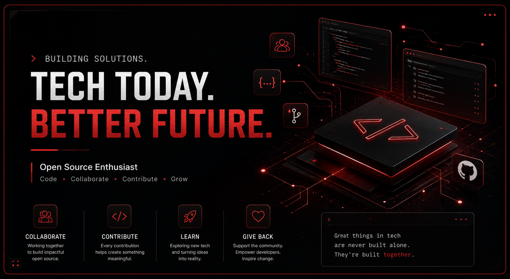
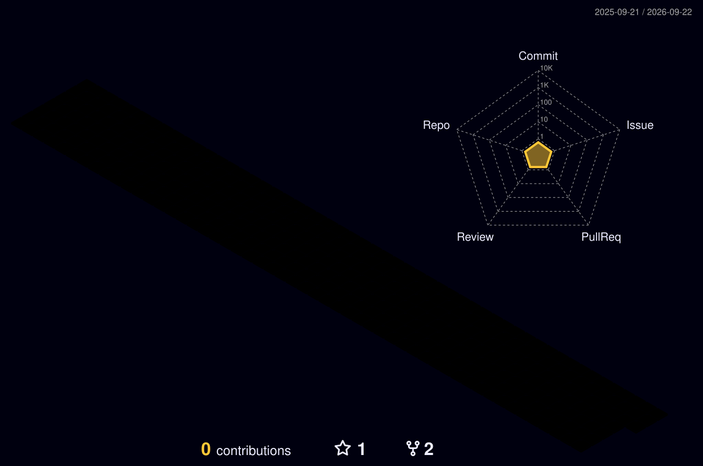

<!-- ═══════════════════════════════════════════════════════════════ -->
<!--                    HERO — HEADLINE BANNER                     -->
<!-- ═══════════════════════════════════════════════════════════════ -->

<p align="center">
  
</p>

<br/>

<!-- ═══════════════════════════════════════════════════════════════ -->
<!--                    SOCIAL BADGES                               -->
<!-- ═══════════════════════════════════════════════════════════════ -->

<div align="center">

[](https://www.linkedin.com/in/bhuvan-somisetty-951276362/)
[](https://github.com/bhuvan-somisetty)
[](mailto:somisettybhuvan5@gmail.com)


</div>

<br/>

<!-- ═══════════════════════════════════════════════════════════════ -->
<!--                    ABOUT ME                                    -->
<!-- ═══════════════════════════════════════════════════════════════ -->

### `> whoami`

**Bhuvan Somisetty**<br/>
Full Stack Developer &middot; Linux Enthusiast &middot; Open Source Contributor<br/>
B.Tech CSE (AI/ML)

Hey! I'm Bhuvan — I enjoy working on real-world software, exploring cloud-native
technologies, and contributing to open source. Most of my open-source time goes
into patching real production codebases across the Kubernetes ecosystem —
[kubernetes-sigs/headlamp](https://github.com/kubernetes-sigs/headlamp), [kyverno](https://github.com/kyverno/kyverno),
[kubeedge](https://github.com/kubeedge/kubeedge), [volcano](https://github.com/volcano-sh/volcano), and
[opentelemetry](https://github.com/open-telemetry/opentelemetry-go-compile-instrumentation). Outside of upstream
work I build my own tools end to end, from a Go-based Kubernetes security scanner
([kmra](https://github.com/bhuvan-somisetty/kmra)) to full-stack AI-powered apps
([ResumeIQ](https://github.com/bhuvan-somisetty/resumeiq-ai), [ChildShield](https://github.com/bhuvan-somisetty/ChildShield)).

**Currently focused on:**
- Linux &amp; Cloud-Native Infrastructure
- Kubernetes &amp; Developer Tooling
- Open Source Contributions
- AI/ML &amp; Full-Stack Engineering

<br/>

<!-- ═══════════════════════════════════════════════════════════════ -->
<!--                    QUICK METRICS                                -->
<!-- ═══════════════════════════════════════════════════════════════ -->

<div align="center">

<table>
<tr>
<td align="center"><b>Public Repos</b><br/>72</td>
<td align="center"><b>PRs Opened</b><br/>~<!--PR_COUNT-->311<!--/PR_COUNT--></td>
<td align="center"><b>PRs Merged</b><br/>~<!--PR_MERGED-->101<!--/PR_MERGED--></td>
<td align="center"><b>Issues Filed</b><br/>~<!--ISSUE_COUNT-->174<!--/ISSUE_COUNT--></td>
</tr>
</table>

<sub>Auto-refreshed daily by <a href="./.github/workflows/update-pr-stats.yml">a GitHub Action</a> against the live GitHub Search API — not hand-typed.</sub>

</div>

<br/>

<!-- ═══════════════════════════════════════════════════════════════ -->
<!--                    TECH STACK                                  -->
<!-- ═══════════════════════════════════════════════════════════════ -->

<h2 align="center">⚙️ &nbsp;Tech Stack</h2>

<div align="center">

**Languages**

[](https://skillicons.dev)

**Frontend**

[](https://skillicons.dev)

**Backend**

[](https://skillicons.dev)

**Databases**

[](https://skillicons.dev)

**AI / ML**

[](https://skillicons.dev)


**DevOps & Cloud**

[](https://skillicons.dev)

**Tools**

[](https://skillicons.dev)

</div>

<br/>

<!-- ═══════════════════════════════════════════════════════════════ -->
<!--                    CURRENT INTERESTS                           -->
<!-- ═══════════════════════════════════════════════════════════════ -->

<h2 align="center">🎯 &nbsp;Current Interests</h2>

<div align="center">

|  |  |
|:---|:---|
| 🤖 Artificial Intelligence | 🧠 Machine Learning |
| 💻 Full Stack Development | 🌐 Open Source |
| ☁️ Cloud & Cloud-Native Technologies | ⚙️ Backend & Distributed Systems |

</div>

<br/>

<!-- ═══════════════════════════════════════════════════════════════ -->
<!--                    GITHUB STATS                                -->
<!-- ═══════════════════════════════════════════════════════════════ -->

<h2 align="center">📊 &nbsp;GitHub Stats</h2>

<div align="center">


&nbsp;


</div>

<br/>

<div align="center">


</div>

<br/>

<h2 align="center">📈 &nbsp;Contribution Activity</h2>

<div align="center">


</div>

<br/>

<h2 align="center">🌐 &nbsp;3D Contribution Graph</h2>

<div align="center">

<picture>
  <source media="(prefers-color-scheme: dark)" srcset="./profile-3d-contrib/profile-night-rainbow.svg"/>
  <source media="(prefers-color-scheme: light)" srcset="./profile-3d-contrib/profile-season-animate.svg"/>
  
</picture>

<sub>Regenerated nightly by <a href="./.github/workflows/profile-3d.yml">a GitHub Action</a> from real commit history.</sub>

</div>

<br/>

<!-- ═══════════════════════════════════════════════════════════════ -->
<!--                    OPEN SOURCE CONTRIBUTIONS                   -->
<!-- ═══════════════════════════════════════════════════════════════ -->

<h2 align="center">🌱 &nbsp;Open Source Contributions</h2>

<div align="center">

I contribute primarily to CNCF and cloud-native projects — mostly reliability
fixes, race conditions, and correctness bugs in Go services.

| Project | Area |
|:---|:---|
| [kubernetes-sigs/headlamp](https://github.com/kubernetes-sigs/headlamp) | Kubernetes web UI |
| [kubescape/kubevuln](https://github.com/kubescape/kubevuln) | Container vulnerability scanning |
| [open-telemetry/opentelemetry-go-compile-instrumentation](https://github.com/open-telemetry/opentelemetry-go-compile-instrumentation) | Go auto-instrumentation |
| [kyverno/kyverno](https://github.com/kyverno/kyverno) | Kubernetes policy engine |
| [kubeedge/kubeedge](https://github.com/kubeedge/kubeedge) | Kubernetes-native edge computing |
| [volcano-sh/volcano](https://github.com/volcano-sh/volcano) | Cloud-native batch scheduling |
| [kubeflow/pipelines](https://github.com/kubeflow/pipelines) | ML pipelines on Kubernetes |
| [jaegertracing/jaeger](https://github.com/jaegertracing/jaeger) | Distributed tracing |

<br/>

**Recent merged pull requests**

| PR | Repository |
|:---|:---|
| [Fix token paste blocked in Chrome on password input](https://github.com/kubernetes-sigs/headlamp/pull/6282) | headlamp |
| [Enable storage, exception filtering & VEX generation in ScanRegistry](https://github.com/kubescape/kubevuln/pull/485) | kubevuln |
| [Make GLS span tracker capacity limits deterministic](https://github.com/open-telemetry/opentelemetry-go-compile-instrumentation/pull/911) | opentelemetry-go-compile-instrumentation |
| [Remove sidecar RPC-wide lock, fix Version() cache poisoning](https://github.com/kubescape/kubevuln/pull/474) | kubevuln |
| [Bound graceful shutdown drain time instead of blocking indefinitely](https://github.com/kubescape/kubevuln/pull/468) | kubevuln |

<sub>Full history: <a href="https://github.com/pulls?q=is%3Apr+author%3Abhuvan-somisetty">github.com/pulls?author=bhuvan-somisetty</a></sub>

</div>

<br/>

<!-- ═══════════════════════════════════════════════════════════════ -->
<!--                    PINNED REPOSITORIES                         -->
<!-- ═══════════════════════════════════════════════════════════════ -->

<h2 align="center">📌 &nbsp;Pinned Repositories</h2>

<br/>

<table align="center" width="100%">
  <tr>
    <td width="50%" valign="top">
      <h3>🛡️ kmra</h3>
      <p>A high-performance Kubernetes manifest security analyzer written in Go — concurrent scanning, rule-based analysis, and multi-format reporting (terminal, JSON, HTML, SARIF).</p>
      <p>
        
        
      </p>
      <a href="https://github.com/bhuvan-somisetty/kmra">
        
      </a>
    </td>
    <td width="50%" valign="top">
      <h3>📄 ResumeIQ</h3>
      <p>AI-powered resume analysis SaaS — instant scoring, ATS checks, and job-matched rewrites. Built with Next.js 15, Prisma, Clerk, and OpenAI.</p>
      <p>
        
        
      </p>
      <a href="https://github.com/bhuvan-somisetty/resumeiq-ai">
        
      </a>
    </td>
  </tr>
  <tr><td colspan="2"><br/></td></tr>
  <tr>
    <td width="50%" valign="top">
      <h3>🧒 ChildShield</h3>
      <p>AI-assisted child safety monitoring application, deployed and live.</p>
      <p>
        
        
      </p>
      <a href="https://github.com/bhuvan-somisetty/ChildShield">
        
      </a>
    </td>
    <td width="50%" valign="top">
      <h3>🏨 Hostel & Mess Feedback System</h3>
      <p>QR-based feedback system for hostel residents — structured issue reporting, meal-wise feedback, and centralized tracking for faster resolution.</p>
      <p>
        
        
      </p>
      <a href="https://github.com/bhuvan-somisetty/Hostel-Mess-Feedback-System">
        
      </a>
    </td>
  </tr>
</table>

<br/>

<!-- ═══════════════════════════════════════════════════════════════ -->
<!--                    CURRENTLY LEARNING                          -->
<!-- ═══════════════════════════════════════════════════════════════ -->

<h2 align="center">🧠 &nbsp;Currently Learning & Building</h2>

<div align="center">

```
┌─────────────────────────────────────────────────────────────┐
│   📚  Learning       →  Distributed systems & K8s internals │
│   🛠️  Building       →  kmra + ResumeIQ                     │
│   🌐  Contributing   →  CNCF / cloud-native OSS projects     │
│   📖  Reading        →  Designing Data-Intensive Applications│
└─────────────────────────────────────────────────────────────┘
```

</div>

<br/>

<!-- ═══════════════════════════════════════════════════════════════ -->
<!--                    CONNECT                                     -->
<!-- ═══════════════════════════════════════════════════════════════ -->

<h2 align="center">🤝 &nbsp;Let's Connect</h2>

<div align="center">

<a href="https://github.com/bhuvan-somisetty">
  
</a>
&nbsp;
<a href="https://www.linkedin.com/in/bhuvan-somisetty-951276362/">
  
</a>
&nbsp;
<a href="mailto:somisettybhuvan5@gmail.com">
  
</a>

<br/><br/>

Open to internships, open-source collaboration, and interesting technical conversations.

</div>

<br/>

<!-- ═══════════════════════════════════════════════════════════════ -->
<!--                    FOOTER                                      -->
<!-- ═══════════════════════════════════════════════════════════════ -->

<div align="center">

> "Talk is cheap. Show me the code." — Linus Torvalds

</div>


